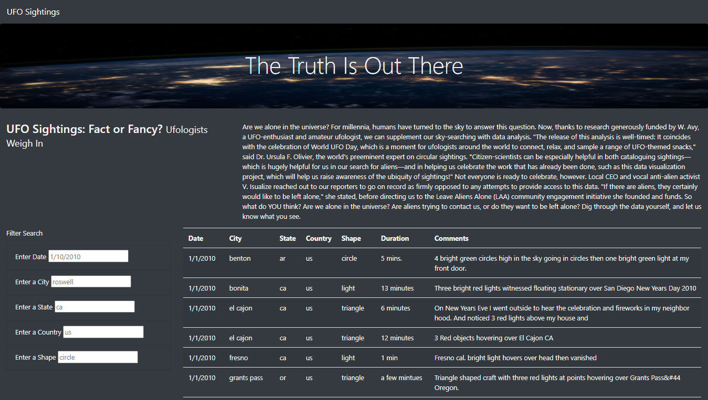
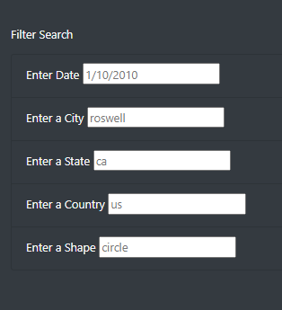

# UFOs
Create a dynamic webpage about UFO sightings.

## Overview of Project
**Task:** Build webpage with a dynamic table of UFO sightings and allow users to filter based on multiple criteria at the same time. The table filters will include the date, city, state, country, and shape. 

**Method:** Using JavaScript, JQuery, HTML, CSS and Bootstrap.

## Resources
- Data Source: [data.js](static/js/data.js)
- Source Code: 
    [app.js](static/js/app.js); [style.css](static/css/style.css); [index.html](index.html)
  
- Programming Languages: JavaScript; HTML; CSS
- Software: VS Code

## Results

The following webpage has been built as part of this project.

**Snapshot of final webpage**

- The users will be able to use the filter options on the left-hand side. Users are able to filter UFO sightings based on the following filters:

    - Date
    - City
    - State
    - Country
    - Shape

Each filter has a placeholder value to provide the user a hint what to enter. Once the user makes their selection, they press enter to view the results.
Filters that are not applicable can be left empty.

**Webpage Filters**

## Summary
The current filters on the webpage offers good functionality for the users by giving them the ability to interact with the data; however, there are ways to improve the functionality. 

- *Examples:*
    - Adding restrictions on the data types entered in the filters (date only for date filter)
    - To ensure that user only chooses filters included in the dataset incorporate drop-downs instead of text fields. 
